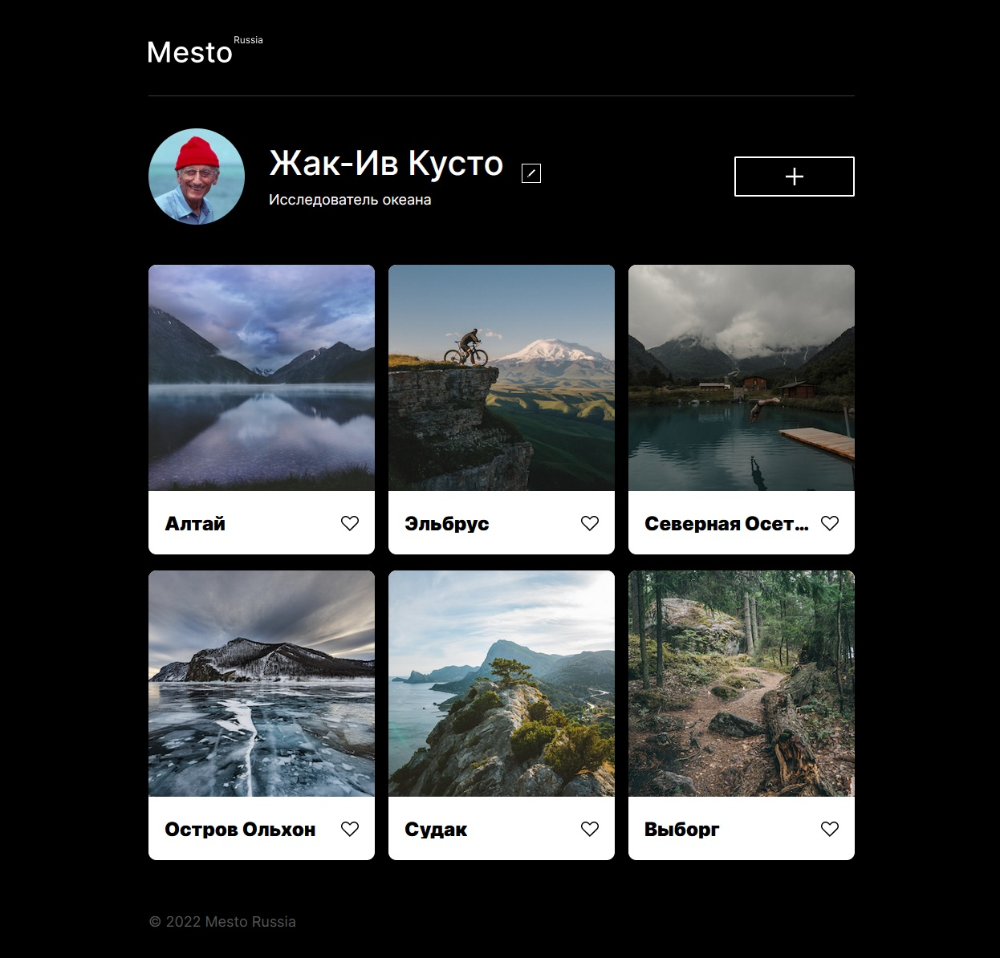

# Сайт "Mesto Russia"

## Превью сайта

## Описание проекта

В проекте использована методология БЭМ Nested, сайт-лендинг адаптирован под экраны от 320 до 1280 пикселей, а также присутствует интерактивность попапа на JavaScript.

## Технологии, использованные в проекте

* HTML
* CSS (FlexBox, Grid)
* БЭМ
* JavaScript

## Ссылка на дэплой проекта

[GitHub Pages](https://mvttsun.github.io/mesto/)
